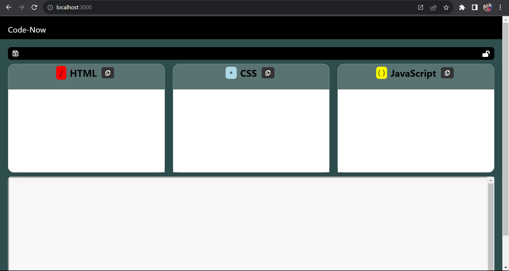

# Code Editor

Code Editor is a versatile web application that enables users to write, edit, and visualize HTML, CSS, and JavaScript code in real-time. It's built using React.js and provides a user-friendly interface for web developers and enthusiasts to experiment with and showcase their coding skills.



## Features

- **Interactive Code Editing:** Separate input sections for HTML, CSS, and JavaScript, allowing you to focus on each aspect of your code.

- **Real-Time Output:** As you type or edit your code, the rendered output is displayed instantly, making it easy to see the results of your changes.

- **Save Your Code:** The application allows you to save your code, making it easy to return to your work later or share it with others.

- **Lock/Unlock Editor:** You can lock the editor to prevent further changes or unlock it to continue editing.

- **Copy Code:** Each input section has a copy button to quickly copy the code to your clipboard for sharing or saving.

- **Responsive Design:** The application is designed to work seamlessly on both mobile and desktop screens.

## Getting Started

To get started with the Code Editor, follow these steps:

1. Clone the repository to your local machine:

   ```bash
   git clone https://github.com/your-username/code-editor.git
   cd code-editor
   ```

Certainly! Here's a more detailed README.md file for your Code Editor project:

markdown
Copy code

# Code Editor

Code Editor is a versatile web application that enables users to write, edit, and visualize HTML, CSS, and JavaScript code in real-time. It's built using React.js and provides a user-friendly interface for web developers and enthusiasts to experiment with and showcase their coding skills.


## Features

- **Interactive Code Editing:** Separate input sections for HTML, CSS, and JavaScript, allowing you to focus on each aspect of your code.

- **Real-Time Output:** As you type or edit your code, the rendered output is displayed instantly, making it easy to see the results of your changes.

- **Save Your Code:** The application allows you to save your code, making it easy to return to your work later or share it with others.

- **Lock/Unlock Editor:** You can lock the editor to prevent further changes or unlock it to continue editing.

- **Copy Code:** Each input section has a copy button to quickly copy the code to your clipboard for sharing or saving.

- **Responsive Design:** The application is designed to work seamlessly on both mobile and desktop screens.

## Getting Started

To get started with the Code Editor, follow these steps:

1. Clone the repository to your local machine:

   ```bash
   git clone https://github.com/your-username/code-editor.git
   cd code-editor
   Install the required dependencies:
   ```

bash
Copy code
npm install
Start the application:

bash
Copy code
npm start
Open your web browser and navigate to http://localhost:3000 to access the Code Editor.

Usage
HTML, CSS, and JavaScript Editing: Use the dedicated input sections to write or edit your HTML, CSS, and JavaScript code.

Real-Time Output: Observe the output section to see how your code is rendered in real-time as you make changes.

Saving Code: Click the "Save" button to save your code. This allows you to preserve your work for future reference.

Lock/Unlock Editor: Use the "Lock/Unlock" button to control whether you can edit the code. Locking the editor prevents further changes.

Copying Code: Each input section features a "Copy" button that allows you to copy the code within that section to your clipboard.

Responsive Design: The Code Editor is designed to adapt to various screen sizes, ensuring a consistent user experience on both mobile and desktop devices.

Technologies Used
React.js: The application is built using the React JavaScript library, providing a dynamic and responsive user interface.

FontAwesome: FontAwesome icons are used to enhance the user interface with recognizable icons for actions like saving and copying code.

Author
Veeral Kansara

License
This project is open-source and licensed under the MIT License. You are welcome to use, modify, and distribute it according to the terms of the license. See the LICENSE file for details.

Acknowledgments
Special thanks to OpenAI for the AI assistance provided during the development of this project.

Enjoy coding with the Code Editor!
